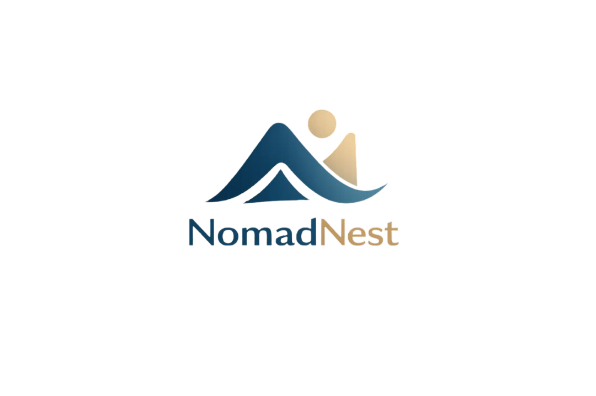

# NomadNest

<p align="center">
  
</p>

<p align="center">
  A modern full-stack accommodation platform inspired by digital nomad culture.
</p>

---

## Overview

NomadNest is a full-stack web application focused on accommodation management and user experience.
The project was built with a modern JavaScript stack using React, Vite, Express, MongoDB, and TailwindCSS.

The main goal of the platform is to provide a clean and intuitive experience for users looking to explore, register, and manage places in a scalable architecture.

---

## Tech Stack

### Front-end

* React 19
* Vite
* React Router DOM
* TailwindCSS
* Axios

### Back-end

* Node.js
* Express
* MongoDB
* Mongoose
* JWT Authentication
* Cookie Parser
* bcryptjs
* CORS

---

## Project Structure

```bash
NomadNest/
│
├── Front-end/
│   ├── src/
│   │   ├── components/
│   │   ├── contexts/
│   │   ├── pages/
│   │   └── App.jsx
│   └── package.json
│
├── Back-end/
│   ├── domains/
│   ├── config/
│   ├── utils/
│   └── index.js
│
└── README.md
```

---

## Features

* User authentication
* JWT-based session handling
* Context API state management
* Responsive interface
* Dynamic routing
* Accommodation/place management
* Modern UI architecture
* API integration with Axios

---

## Installation

### Clone the repository

```bash
git clone https://github.com/MaykonDSMarques/NomadNest.git
```

---

## Front-end Setup

```bash
cd Front-end
npm install
npm run dev
```

The application will run locally on:

```bash
http://localhost:5173
```

---

## Back-end Setup

```bash
cd Back-end
npm install
npm run dev
```

---

## Environment Variables

### Front-end `.env`

```env
VITE_AXIOS_BASE_URL=http://localhost:PORT
```

### Back-end `.env`

```env
PORT=YOUR_PORT
MONGO_URL=YOUR_MONGO_CONNECTION
JWT_SECRET=YOUR_SECRET
```

---

## Authentication Flow

NomadNest uses JWT authentication combined with HTTP cookies to manage user sessions securely.

### Flow Summary

1. User registers or logs in
2. Server validates credentials
3. JWT token is generated
4. Token is stored using cookies
5. Protected routes validate the token

---

## Architecture Highlights

* Modular back-end domain structure
* Component-based front-end architecture
* Context API for global state management
* REST API communication
* Separation between UI, business logic, and persistence layers

---

## Future Improvements

* Image upload support
* Booking system
* Search and filters
* Reviews and ratings
* Maps integration
* Deployment pipeline
* Docker support
* Admin dashboard
* Payment integration
* Favorites system

---


## Development Notes

This project was created as a study and portfolio application focused on:

* Full-stack architecture
* Authentication systems
* Modern React ecosystem
* REST API development
* Scalable project organization

---

## Author

Made by Maykon Marques.

* GitHub: [https://github.com/MaykonDSMarques](https://github.com/MaykonDSMarques)

---

## License

This project is licensed under the MIT License.
